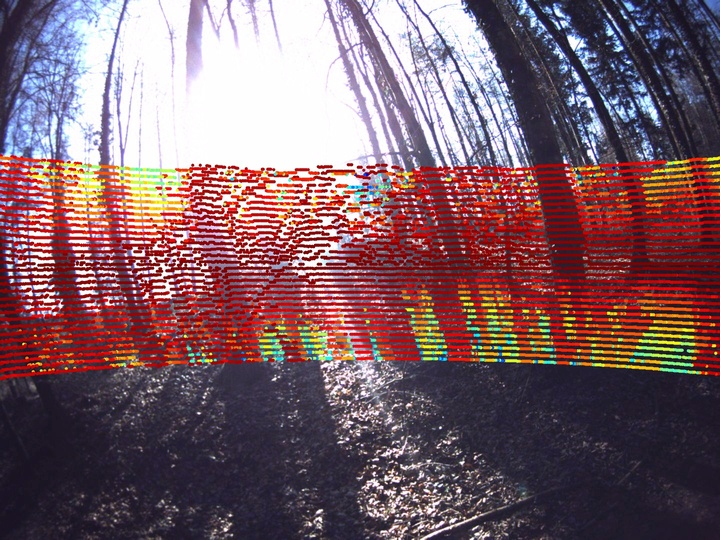
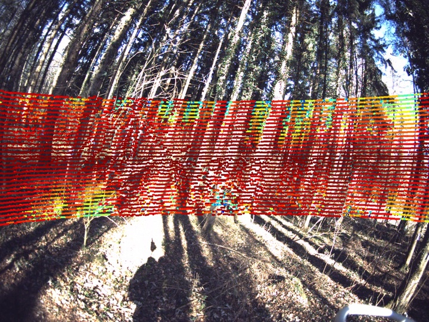

# DigiForests Extrinsics

This example code provides the extrinsics for the devices used in the DigiForests dataset and provides a Python notebook to load extrinsics and visualize LiDAR overlays on top of images.

The example code includes functionality to generate image-LiDAR overlays, which can be used to visualize the alignment of LiDAR point clouds with camera images. Below is an example of an overlay visualization:

<p style="margin: auto; text-align: center;">
  
  
  
</p>

## Setup

To use the provided code, follow these steps:

1. Create a Python virtual environment (optional but recommended):
    ```bash
    python3 -m venv venv
    source venv/bin/activate
    ```

2. Install the required dependencies:
   ```bash
    pip install -r requirements.txt
    ```
3. Ensure you have the necessary data files:
- The sensor configuration YAML files for are in the `extrinsics/` directory.
- For the example code, we provide a small example file: https://www.ipb.uni-bonn.de/data/digiforest-dataset/data/calibration_example.zip

## Usage
- Open the 'image_lidar_overlay.ipynb' notebook in Jupyter or VS Code.
- Update the paths for the sensor YAML file and SLAM folder in the notebook
    ```bash
    sensor_yaml = "/path/to/sensors_extrinsics.yaml"
    slam_folder = "/path/to/slam_folder"
    ```
- Run the notebook to generate image-LiDAR overlays. The output images will be saved in the overlay/ directory.